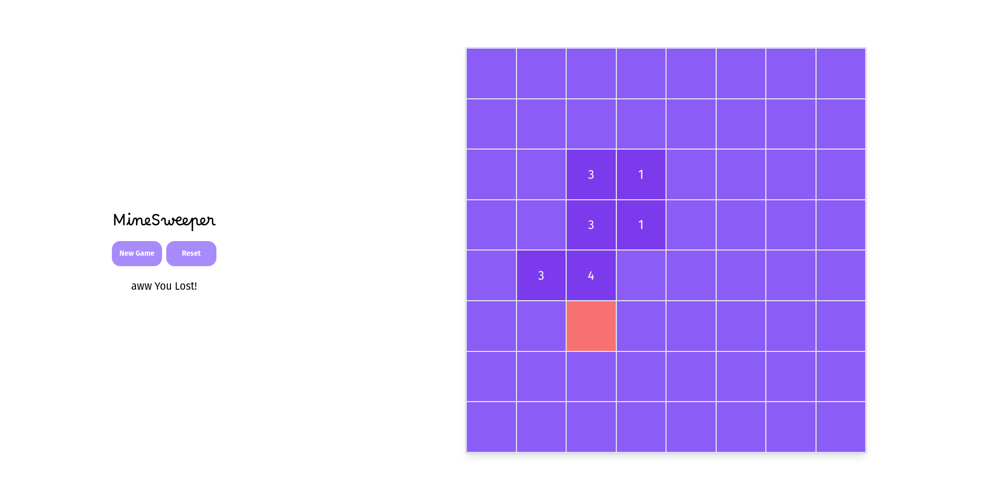

# Minesweeper

Simple Minesweeper game created with React and Vite

## Table of contents

- [General Info](#general-info)
- [Technologies Used](#technologies-used)
- [Features](#features)
- [Screenshots](#screenshots)
- [Setup](#setup)
- [Project Status](#project-status)
- [Room for Improvement](#room-for-improvement)
- [To do](#to-do)
- [Contact](#contact)

## General Info

This project was created to allow me to build a project using Vite and further my experience with front end technologies.

This project also allowed me to manage complex state with this project using zustand and an array of objects.

## Technologies Used

Project is created with:

- React 18.0
- Vite 2.9
- Zustand 4
- Vitest 0.12

## Features

- Simple minesweeper game
- left click to reveal number from of adjacent tiles
- Right click to place flag
- Win by revealing all tiles and placing flags on all mines
- Go back if you make a wrong move

## Screenshots



## Setup

main channel has 'working' version
dev channel has more up to date code and features. However code may be incomplete, or won't run at all.

To run this project, install it locally using npm:

```
$ cd ../minesweeper
$ npm install
$ npm run dev
```

## Project Status

Project is: _in progress_

## Room for Improvement

- More consistency with modular component design

## Contact

Created by me - feel free to contact me!
